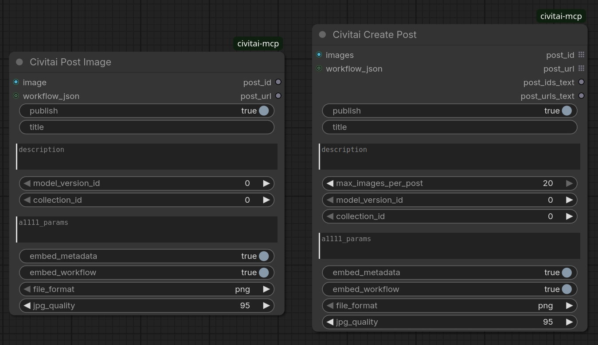
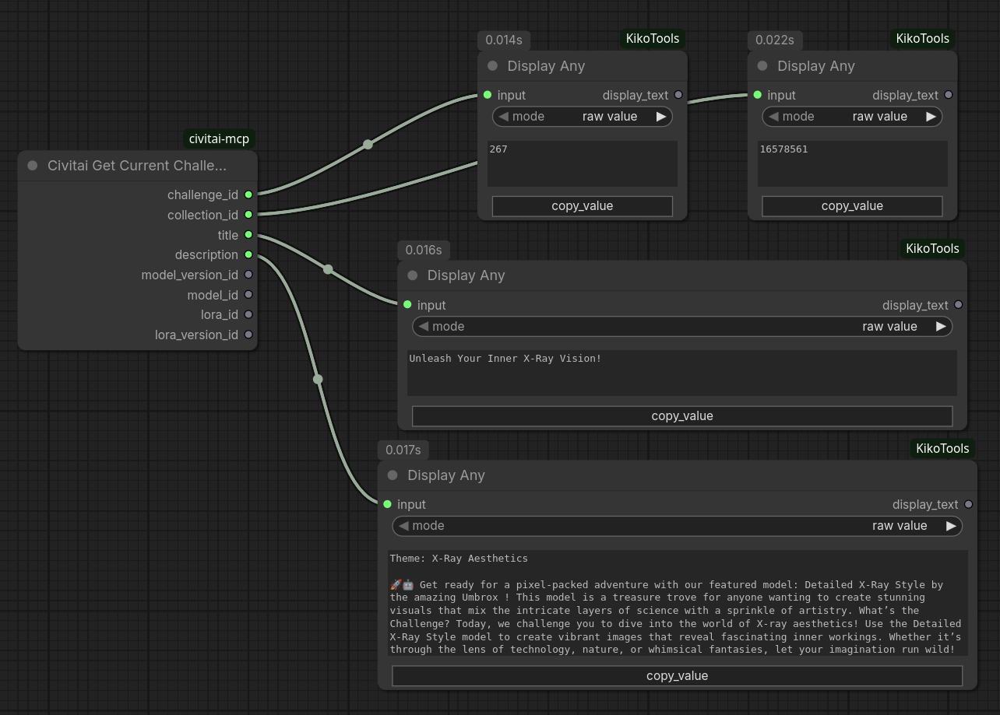
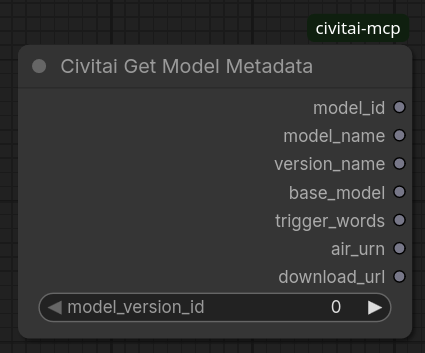
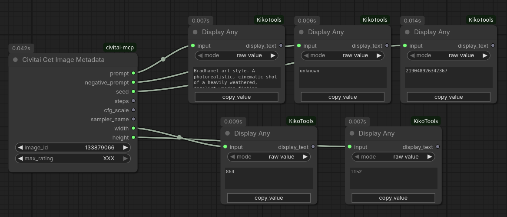
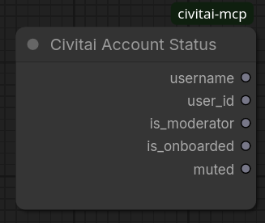
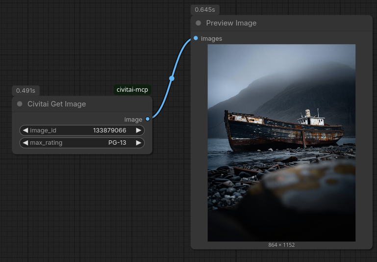

# ComfyUI Civitai MCP Node Pack

This custom node pack exposes Civitai social sharing actions directly inside ComfyUI workflows using the **Civitai MCP Server** endpoints.

It allows you to automatically publish your generated images directly to Civitai or save them as drafts for later.

## 🚀 Features

* **Social Posting**:
  * **Civitai Post Image**: Quickly upload and post a single image.
  * **Civitai Create Post**: Upload multiple images and post them together as a single multi-image post. Supports linking to models and collections/contests.
* **Metadata & Discovery**:
  * **Civitai Get Model Metadata**: Fetch trigger words, parent model names, base model types (SDXL, Flux, etc.), URNs, and download links for any model version.
  * **Civitai Get Image Metadata**: Recover prompts, seeds, sampler names, CFG scales, and steps from any Civitai image ID.
  * **Civitai Get Image**: Retrieve and load the actual image tensor directly into your ComfyUI workspace for previews or upscaling.
* **Community & Challenges**:
  * **Civitai Get Current Challenge**: Fetch active daily challenges, rules, and resolve recommended base model/LoRA checkpoints.
* **Account Diagnostics**:
  * **Civitai Account Status**: Inspect your API key settings, current username, user ID, Buzz balance progress, and account permissions.

---

## 🛠️ Installation

### ComfyUI Manager (Recommended)
Search for **ComfyUI Civitai MCP** in the [ComfyUI Manager](https://github.com/ltdrdata/ComfyUI-Manager) node registry and install with one click.

### Linux / macOS
Clone this repository into your ComfyUI `custom_nodes` directory:
```bash
cd ComfyUI/custom_nodes
git clone https://github.com/daceheg/ComfyUI-civitai-mcp.git
```

### Windows
Open a Command Prompt (`cmd`) or PowerShell in your ComfyUI directory:
```cmd
cd ComfyUI\custom_nodes
git clone https://github.com/daceheg/ComfyUI-civitai-mcp.git
```

---

## 🔑 Authentication / Setup

To use the posting nodes, you must provide a Civitai API Key.

> [!IMPORTANT]
> **API Key Serialization Protection**
> To prevent your API key from being accidentally serialized into your workflow JSON metadata (which ComfyUI embeds inside generated PNG images by default), **there are no text inputs for the API key on the nodes themselves**.

Configure your API key in one of two secure ways:

1. **Text File (Recommended)**: Create a plain text file named `civitai_key.txt` directly inside this custom node directory (`ComfyUI/custom_nodes/ComfyUI-civitai-mcp/civitai_key.txt`) containing only your API key.
2. **Environment Variable**: Set the `CIVITAI_API_KEY` environment variable in your shell or launcher script.

---

## 🧩 Nodes reference

> [!CAUTION]
> **Legal Disclaimer & Warning**
> Using these nodes to automate posting or sharing content to Civitai may result in the upload of material that violates the Civitai Terms of Service (TOS), Community Guidelines, or local, state, national, or international laws. 
> 
> * **Account Risk**: Posting prohibited or improperly labeled content can result in your Civitai account being permanently banned, muted, or having your Buzz balance confiscated.
> * **Legal Liability**: You are solely responsible for all content uploaded via your account/API key. Distributing illegal, non-consensual, copyrighted, or prohibited material can lead to legal action, fines, or criminal prosecution under applicable laws and regulations.
> * **Disclaimer of Liability**: The creator of this node pack assumes **no liability or responsibility** for any misuse of these nodes. By installing and using this software, you assume all risk and agree to comply with all applicable laws and Civitai policies. Use responsibly.


### 1. Civitai Post Image
Uploads and creates a separate Civitai post for each image in the input tensor.

* **Inputs**:
  * `image` (Required): The image tensor to upload. If a batch of images is passed, it loops through and creates a separate post for each image.
  * `publish` (Required): Set to `True` to publish the post immediately. Set to `False` to create it as a draft.
  * `title` (Optional): The title of the post. If a batch is passed, this will be suffixed with `(1)`, `(2)`, etc.
  * `description` (Optional): Description of the post (plain text or Markdown).
  * `model_version_id` (Optional): Link each post to a specific model version on Civitai.
  * `collection_id` (Optional): Add each post to a specific collection or contest.
* **Outputs**:
  * `post_id` (INT): The ID of the created Civitai post.
  * `post_url` (STRING): The public link to the created post (or draft link).

### 2. Civitai Create Post
Posts multiple images together as a single combined post.

* **Inputs**:
  * `images` (Required): A batch of images (e.g. from an Image Batch node or a batched generation).
  * `publish` (Required): Set to `True` to publish immediately, or `False` for draft mode.
  * `title` (Optional): The title of the post.
  * `description` (Optional): Description of the post.
  * `model_version_id` (Optional): Link the post to a specific model version on Civitai (e.g. checkpoint/Lora version ID).
  * `collection_id` (Optional): Add the post to a specific Civitai collection/contest (requires collection ID).
* **Outputs**:
  * `post_id` (INT): The ID of the created Civitai post.
  * `post_url` (STRING): The public link to the created post.

### 3. Civitai Get Current Challenge
Fetches the active daily challenge details from Civitai. If the daily challenge uses a LoRA, it automatically resolves and outputs the recommended base checkpoint's model ID and version ID so they can be loaded directly.

* **Outputs**:
  * `challenge_id` (INT): The ID of the challenge.
  * `collection_id` (INT): The collection ID associated with the challenge (connect directly to collection inputs of posting nodes).
  * `title` (STRING): The title of the daily challenge.
  * `description` (STRING): The brief description including the theme and rules.
  * `model_version_id` (INT): The target model version ID for the challenge checkpoint (or default base checkpoint version ID if it's a LoRA).
  * `model_id` (INT): The model ID for the challenge checkpoint (or default base checkpoint model ID if it's a LoRA).
  * `lora_id` (INT): The challenge LoRA model ID (or 0 if Checkpoint).
  * `lora_version_id` (INT): The challenge LoRA version ID (or 0 if Checkpoint).

### 4. Civitai Get Model Metadata
Fetches detailed metadata for a specific model version ID using the public REST API.

* **Inputs**:
  * `model_version_id` (Required): The model version ID (e.g. checkpoint/LoRA version ID) to query.
* **Outputs**:
  * `model_id` (INT): The model ID.
  * `model_name` (STRING): The parent model's name.
  * `version_name` (STRING): The name of this model version.
  * `base_model` (STRING): The base model type (e.g. `SDXL 1.0`, `Flux.1 Dev`).
  * `trigger_words` (STRING): A comma-separated string of trigger/trained words for this model version.
  * `air_urn` (STRING): The Civitai URN (AIR) for this version.
  * `download_url` (STRING): The direct file download URL.

### 5. Civitai Get Image Metadata
Fetches generation parameters (prompt, seed, steps, etc.) for a specific image ID from Civitai.

* **Inputs**:
  * `image_id` (Required): The Civitai image ID to query.
  * `max_rating` (Required): The maximum content rating level to allow fetching (`PG`, `PG-13`, `R`, `X`, `XXX`). Defaults to `XXX`.
* **Outputs**:
  * `prompt` (STRING): The positive generation prompt.
  * `negative_prompt` (STRING): The negative prompt.
  * `seed` (INT): The generation seed.
  * `steps` (INT): The number of sampling steps.
  * `cfg_scale` (FLOAT): The CFG scale.
  * `sampler_name` (STRING): The sampler/scheduler name.
  * `width` (INT): The width of the image.
  * `height` (INT): The height of the image.

### 6. Civitai Account Status
Checks your current Civitai profile status using your configured API key.

* **Outputs**:
  * `username` (STRING): Your Civitai username.
  * `user_id` (INT): Your Civitai user ID.
  * `is_moderator` (BOOLEAN): True if the account is a moderator.
  * `is_onboarded` (BOOLEAN): True if the account is fully onboarded.
  * `muted` (BOOLEAN): True if the account is muted/restricted.

### 7. Civitai Get Image
Downloads the actual image tensor from a Civitai image ID.

* **Inputs**:
  * `image_id` (Required): The Civitai image ID to download.
  * `max_rating` (Required): The maximum content rating level to allow fetching (`PG`, `PG-13`, `R`, `X`, `XXX`). Defaults to `XXX`.
* **Outputs**:
  * `image` (IMAGE): The loaded image tensor, formatted for ComfyUI nodes (e.g. preview, save, or upscale nodes).

---

## 🔒 Security & Privacy

This node pack communicates directly with `https://mcp.civitai.com/mcp` using native Python request libraries (`urllib`). Your API key is sent securely in the request header and is never stored, tracked, or sent to third-party endpoints.

---

## 📸 Example Workflows

### Post Image / Create Post


### Get Current Challenge


### Get Model Metadata


### Get Image Metadata


### Account Status


### Get Image

