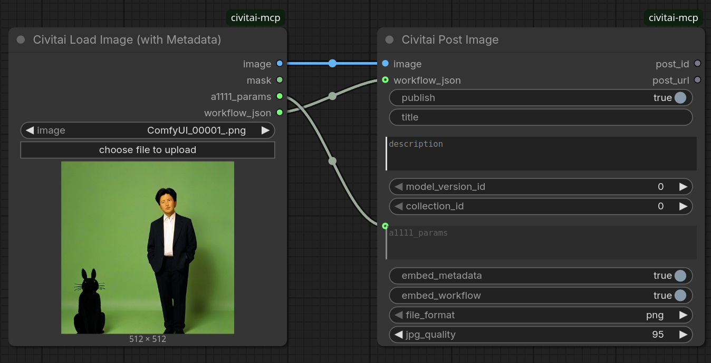
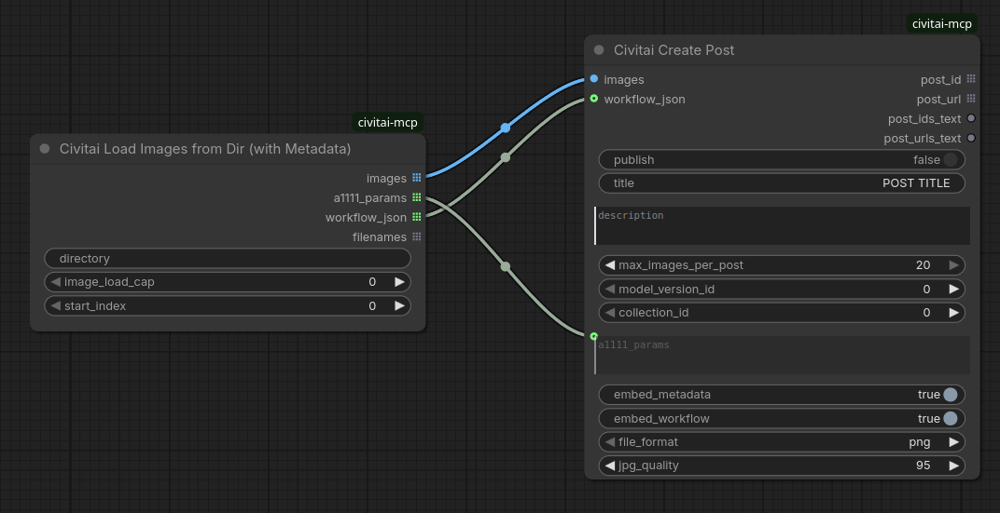
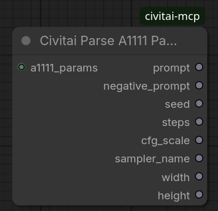

# ComfyUI Civitai MCP Node Pack

This custom node pack exposes Civitai social sharing actions directly inside ComfyUI workflows using the **Civitai MCP Server** endpoints.

It allows you to automatically publish your generated images directly to Civitai or save them as drafts for later.

## 🚀 Features

* **Social Posting**:
  * **Civitai Post Image**: Quickly upload and post a single image, with full generation metadata embedded automatically.
  * **Civitai Create Post**: Upload multiple images and post them together as a single multi-image post. Supports linking to models and collections/contests.
  * **Full metadata embedding**: Both posting nodes auto-detect generation parameters from your workflow (prompt, sampler, seed, and a resolved `Civitai resources` list of AIR URNs) and embed them so Civitai shows complete metadata — no manual wiring required. Accepts an explicit `a1111_params` string (e.g. from ComfyUI-Image-Saver) when you want full control.
* **Metadata Loading & Parsing**:
  * **Civitai Load Image (with Metadata)**: Load an image *and* recover its embedded generation metadata, ready to wire straight into the posting nodes.
  * **Civitai Load Images from Dir (with Metadata)**: Batch-load every image in a directory along with each one's metadata, for posting an existing folder of renders.
  * **Civitai Parse A1111 Params**: Break an A1111/Civitai parameters string into individual fields (prompt, seed, sampler, size, etc.).
* **Metadata & Discovery**:
  * **Civitai Get Model Metadata**: Fetch trigger words, parent model names, base model types (SDXL, Flux, etc.), URNs, and download links for any model version.
  * **Civitai Get Image Metadata**: Recover prompts, seeds, sampler names, CFG scales, steps, and tags from any Civitai image ID.
  * **Civitai Get Image**: Retrieve and load the actual image tensor directly into your ComfyUI workspace for previews or upscaling.
* **Community & Challenges**:
  * **Civitai Get Current Challenge**: Fetch active daily challenges, rules, and resolve recommended base model/LoRA checkpoints.
* **Account Diagnostics**:
  * **Civitai Account Status**: Inspect your API key settings, current username, user ID, Buzz balance progress, and account permissions.

---

## 🛠️ Installation

### ComfyUI Manager (Recommended)
Search for **ComfyUI Civitai MCP** in the [ComfyUI Manager](https://github.com/ltdrdata/ComfyUI-Manager) node registry and install with one click.

### Linux / macOS
Clone this repository into your ComfyUI `custom_nodes` directory:
```bash
cd ComfyUI/custom_nodes
git clone https://github.com/daceheg/ComfyUI-civitai-mcp.git
```

### Windows
Open a Command Prompt (`cmd`) or PowerShell in your ComfyUI directory:
```cmd
cd ComfyUI\custom_nodes
git clone https://github.com/daceheg/ComfyUI-civitai-mcp.git
```

---

## 🔑 Authentication / Setup

To use the posting nodes, you must provide a Civitai API Key.

> [!IMPORTANT]
> **API Key Serialization Protection**
> To prevent your API key from being accidentally serialized into your workflow JSON metadata (which ComfyUI embeds inside generated PNG images by default), **there are no text inputs for the API key on the nodes themselves**.

Configure your API key in one of two secure ways:

1. **Text File (Recommended)**: Create a plain text file named `civitai_key.txt` directly inside this custom node directory (`ComfyUI/custom_nodes/ComfyUI-civitai-mcp/civitai_key.txt`) containing only your API key.
2. **Environment Variable**: Set the `CIVITAI_API_KEY` environment variable in your shell or launcher script.

---

## 🧩 Nodes reference

> [!CAUTION]
> **Legal Disclaimer & Warning**
> Using these nodes to automate posting or sharing content to Civitai may result in the upload of material that violates the Civitai Terms of Service (TOS), Community Guidelines, or local, state, national, or international laws. 
> 
> * **Account Risk**: Posting prohibited or improperly labeled content can result in your Civitai account being permanently banned, muted, or having your Buzz balance confiscated.
> * **Legal Liability**: You are solely responsible for all content uploaded via your account/API key. Distributing illegal, non-consensual, copyrighted, or prohibited material can lead to legal action, fines, or criminal prosecution under applicable laws and regulations.
> * **Disclaimer of Liability**: The creator of this node pack assumes **no liability or responsibility** for any misuse of these nodes. By installing and using this software, you assume all risk and agree to comply with all applicable laws and Civitai policies. Use responsibly.


### 1. Civitai Post Image
Uploads one image and creates a Civitai post for it. Because it posts a single image per execution, it pairs naturally with sequential workflows (e.g. an LLM/CR Prompt List feeding prompts one at a time): ComfyUI re-runs the graph once per prompt, and this node creates a separate post for each resulting image automatically.

* **Inputs**:
  * `image` (Required): The image tensor to upload. If a *single execution* passes a **batch** tensor (multiple images at once, e.g. from an Image Batch node or `batch_size > 1`), only the first image is posted — use **Civitai Create Post** to post a batch together.
  * `publish` (Required): Set to `True` to publish the post immediately. Set to `False` to create it as a draft.
  * `title` (Optional): The title of the post.
  * `description` (Optional): Description of the post (plain text or Markdown).
  * `model_version_id` (Optional): Link each post to a specific model version on Civitai.
  * `collection_id` (Optional): Add each post to a specific collection or contest.
  * `a1111_params` (Optional): An A1111-format generation parameters string to embed verbatim. Wire ComfyUI-Image-Saver's `a1111_params` output (or a Civitai metadata loader) here for full metadata. If left empty, the node auto-detects parameters from the current workflow.
  * `workflow_json` (Optional): A ComfyUI workflow JSON string to embed (PNG only). Wire a Civitai metadata loader's `workflow_json` output here to preserve the *original* graph when re-posting a saved image. Takes precedence over the live workflow; falls back to it when empty.
  * `embed_metadata` (Optional, default `True`): Embed generation parameters into the uploaded image so Civitai shows full metadata.
  * `embed_workflow` (Optional, default `True`): Embed the ComfyUI workflow + prompt graph (PNG only) so the post is reproducible by drag-and-drop into ComfyUI.
  * `file_format` (Optional, default `png`): `png` carries metadata + workflow in text chunks (lossless); `jpg` carries the parameters in EXIF (smaller, no workflow).
  * `jpg_quality` (Optional, default `95`): JPEG quality (only used when `file_format` is `jpg`).
* **Outputs**:
  * `post_id` (INT): The ID of the created Civitai post.
  * `post_url` (STRING): The public link to the created post (or draft link).

### 2. Civitai Create Post
Posts one or more images together as a combined post. Works with anywhere from a single image up to Civitai's limit of 20 per post; if more images are passed, they are automatically split across multiple posts.

* **Inputs**:
  * `images` (Required): One or more images (e.g. from an Image Batch node, a batched generation, or a Civitai metadata loader).
  * `publish` (Required): Set to `True` to publish immediately, or `False` for draft mode.
  * `title` (Optional): The title of the post. When images are split across multiple posts, each title is suffixed with ` (1)`, ` (2)`, etc.
  * `description` (Optional): Description of the post.
  * `max_images_per_post` (Optional, default `20`, min `1`, max `20`): Maximum images per post. Civitai caps posts at 20 images; if more are passed, they are split into multiple posts of up to this many images each.
  * `model_version_id` (Optional): Link the post to a specific model version on Civitai (e.g. checkpoint/Lora version ID).
  * `collection_id` (Optional): Add the post to a specific Civitai collection/contest (requires collection ID).
  * `a1111_params` (Optional): An A1111-format parameters string to embed. Accepts a list (one per image); a single value is applied to all images. If empty, parameters are auto-detected per image from the workflow.
  * `workflow_json` (Optional): A ComfyUI workflow JSON string to embed (PNG only). Wire a Civitai metadata loader's `workflow_json` output here to preserve the original graph of re-posted images. Takes precedence over the live workflow; falls back to it when empty.
  * `embed_metadata` (Optional, default `True`): Embed generation parameters into each uploaded image.
  * `embed_workflow` (Optional, default `True`): Embed the ComfyUI workflow + prompt graph (PNG only).
  * `file_format` (Optional, default `png`): `png` (metadata + workflow, lossless) or `jpg` (parameters in EXIF, smaller, no workflow).
  * `jpg_quality` (Optional, default `95`): JPEG quality (only used when `file_format` is `jpg`).
* **Outputs**:
  * `post_id` (INT list): The ID of each created Civitai post — one entry per post (a single post yields a single-element list).
  * `post_url` (STRING list): The public link to each created post.
  * `post_ids_text` (STRING): All post IDs as a single newline-joined string. Use this with display/save nodes, which only see the first element of a list input.
  * `post_urls_text` (STRING): All post URLs as a single newline-joined string — wire into a text display/save node to see every created post.

### 3. Civitai Get Current Challenge
Fetches the active daily challenge details from Civitai. If the daily challenge uses a LoRA, it automatically resolves and outputs the recommended base checkpoint's model ID and version ID so they can be loaded directly.

* **Outputs**:
  * `challenge_id` (INT): The ID of the challenge.
  * `collection_id` (INT): The collection ID associated with the challenge (connect directly to collection inputs of posting nodes).
  * `title` (STRING): The title of the daily challenge.
  * `description` (STRING): The brief description including the theme and rules.
  * `model_version_id` (INT): The target model version ID for the challenge checkpoint (or default base checkpoint version ID if it's a LoRA).
  * `model_id` (INT): The model ID for the challenge checkpoint (or default base checkpoint model ID if it's a LoRA).
  * `lora_id` (INT): The challenge LoRA model ID (or 0 if Checkpoint).
  * `lora_version_id` (INT): The challenge LoRA version ID (or 0 if Checkpoint).

### 4. Civitai Get Model Metadata
Fetches detailed metadata for a specific model version ID using the public REST API.

* **Inputs**:
  * `model_version_id` (Required): The model version ID (e.g. checkpoint/LoRA version ID) to query.
* **Outputs**:
  * `model_id` (INT): The model ID.
  * `model_name` (STRING): The parent model's name.
  * `version_name` (STRING): The name of this model version.
  * `base_model` (STRING): The base model type (e.g. `SDXL 1.0`, `Flux.1 Dev`).
  * `trigger_words` (STRING): A comma-separated string of trigger/trained words for this model version.
  * `air_urn` (STRING): The Civitai URN (AIR) for this version.
  * `download_url` (STRING): The direct file download URL.

### 5. Civitai Get Image Metadata
Fetches generation parameters (prompt, seed, steps, etc.) for a specific image ID from Civitai.

* **Inputs**:
  * `image_id` (Required): The Civitai image ID to query.
  * `max_rating` (Required): The maximum content rating level to allow fetching (`PG`, `PG-13`, `R`, `X`, `XXX`). Defaults to `XXX`.
* **Outputs**:
  * `prompt` (STRING): The positive generation prompt.
  * `negative_prompt` (STRING): The negative prompt.
  * `seed` (INT): The generation seed.
  * `steps` (INT): The number of sampling steps.
  * `cfg_scale` (FLOAT): The CFG scale.
  * `sampler_name` (STRING): The sampler/scheduler name.
  * `width` (INT): The width of the image.
  * `height` (INT): The height of the image.
  * `tags` (STRING): A comma-separated list of the image's Civitai tags.

### 6. Civitai Account Status
Checks your current Civitai profile status using your configured API key.

* **Outputs**:
  * `username` (STRING): Your Civitai username.
  * `user_id` (INT): Your Civitai user ID.
  * `is_moderator` (BOOLEAN): True if the account is a moderator.
  * `is_onboarded` (BOOLEAN): True if the account is fully onboarded.
  * `muted` (BOOLEAN): True if the account is muted/restricted.

### 7. Civitai Get Image
Downloads the actual image tensor from a Civitai image ID.

* **Inputs**:
  * `image_id` (Required): The Civitai image ID to download.
  * `max_rating` (Required): The maximum content rating level to allow fetching (`PG`, `PG-13`, `R`, `X`, `XXX`). Defaults to `XXX`.
* **Outputs**:
  * `image` (IMAGE): The loaded image tensor, formatted for ComfyUI nodes (e.g. preview, save, or upscale nodes).

### 8. Civitai Load Image (with Metadata)
Loads an image from your ComfyUI `input` directory (with the standard file picker, upload button, and preview) and — unlike the stock Load Image node — also recovers the generation metadata embedded in the file. Wire its outputs straight into the posting nodes to re-post a saved image with its original metadata and workflow intact.

It understands the full A1111/Civitai `parameters` string (PNG text chunk or JPEG EXIF), and for images saved by the stock ComfyUI SaveImage node (which embed only the prompt graph) it synthesizes an equivalent parameters string automatically.

* **Inputs**:
  * `image` (Required): The image file to load (dropdown of files in the `input` directory; supports the upload button).
* **Outputs**:
  * `image` (IMAGE): The loaded image tensor.
  * `mask` (MASK): The alpha mask (or a zero mask when the image has no alpha channel).
  * `a1111_params` (STRING): The recovered/synthesized A1111-format parameters string (empty if the image carries no metadata). Wire into a posting node's `a1111_params`.
  * `workflow_json` (STRING): The embedded ComfyUI workflow JSON (empty if absent). Wire into a posting node's `workflow_json`.

### 9. Civitai Load Images from Dir (with Metadata)
Batch-loads every image in a directory along with each image's embedded metadata, returning parallel lists ready to feed **Civitai Create Post** for posting an existing folder of renders in one go.

* **Inputs**:
  * `directory` (Required): Absolute path to a directory of images.
  * `image_load_cap` (Optional, default `0`): Maximum number of images to load (`0` = no limit).
  * `start_index` (Optional, default `0`): Skip this many images (sorted by filename) before loading.
* **Outputs**:
  * `images` (IMAGE list): The loaded image tensors.
  * `a1111_params` (STRING list): Each image's recovered/synthesized parameters string.
  * `workflow_json` (STRING list): Each image's embedded ComfyUI workflow JSON (empty entry when absent). Wire into **Civitai Create Post**'s `workflow_json` so each re-posted image keeps its own original graph.
  * `filenames` (STRING list): The filename of each loaded image.

### 10. Civitai Parse A1111 Params
Breaks an A1111/Civitai `parameters` string into individual typed fields. Wire it from a metadata loader's `a1111_params` output (or paste a string) to drive other nodes with the prompt, seed, sampler, dimensions, etc.

* **Inputs**:
  * `a1111_params` (Required): The A1111-format parameters string to parse.
* **Outputs**:
  * `prompt` (STRING): The positive prompt.
  * `negative_prompt` (STRING): The negative prompt.
  * `seed` (INT): The generation seed.
  * `steps` (INT): The number of sampling steps.
  * `cfg_scale` (FLOAT): The CFG scale.
  * `sampler_name` (STRING): The sampler/scheduler name.
  * `width` (INT): The parsed image width.
  * `height` (INT): The parsed image height.

---

## 🔒 Security & Privacy

This node pack communicates only with Civitai's own endpoints (`https://mcp.civitai.com` and `https://civitai.com`) using the standard Python `requests` library. Your API key is sent solely as an `Authorization: Bearer` header to Civitai to authenticate to your account, and is never logged, stored elsewhere, or sent to any third-party endpoint.

---

## 📸 Example Workflows

### Post Image / Create Post


### Load Image (with Metadata)


### Load Images from Dir (with Metadata)


### Parse A1111 Params


### Get Current Challenge


### Get Model Metadata


### Get Image Metadata


### Account Status


### Get Image

